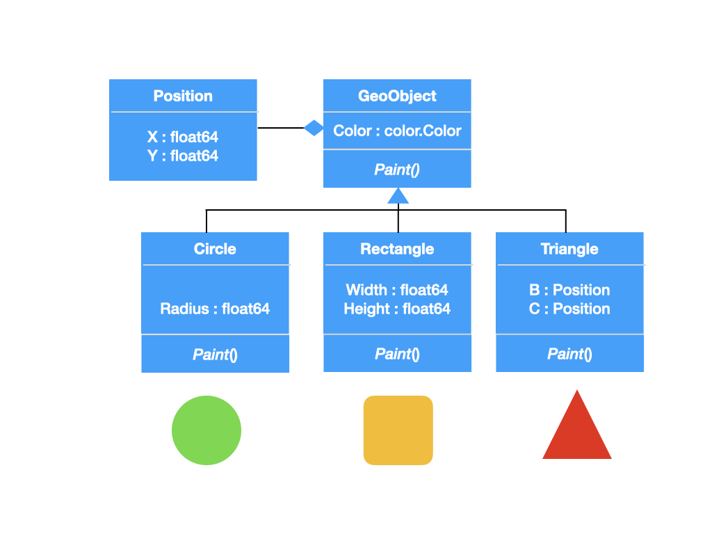

# Exercise 3 - OOP in Go

If you are not get finished during the lecture hours, please finish it as homework.

## Exercise 3.1 - Interfaces, Polymorphism and Embedding

The image shows a typical UML design with inheritance, aggregation and polymorph methods.



Implement this design as close as possible to the design in Go:
- The Paint() method should print the names and values of the fields to the console
- Allocate an array of polymorph objects and call Paint() in a loop 

## Exercise 3.2 - Mail Component and Service Locator
Implement the following interface:
```go
type Sender interface {

	// Send an email to a given address with a  message.
	SendMail(address Address, message string)
}
```
Implement the interface and write a client. The implementation should be provided by
a service locator registry:

```go
    // Create an implementation for the mail.Sender interface
	var sender = Registry.Get("mail.Sender").(mail.Sender)

	mailaddrs := mail.Address{Address: address}
	sender.SendMail(mailaddrs, message)
```

## Exercise 3.3 - AST - Abstract Syntax Tree
Write a programm which builds an AST with nodes to evaluate logical expressions with (And, Not, Or with variables)

```
Sample Expression: (A AND B) OR C

            ----------
            |   OR   |
            ----------
            /        \
        ---------     ----------
        |  AND  |     |  VAR:C |
        ---------     ----------
        /       \
  ---------   --------- 
  | Var:A |   | Var:B |
  ---------   ---------
```

The tree should be evaluated with a evaluation methods which suppports named variables:

```go
eval(vars map[string]bool) bool
```

Write a unit test which builds the AST and evaluates with given variables.
